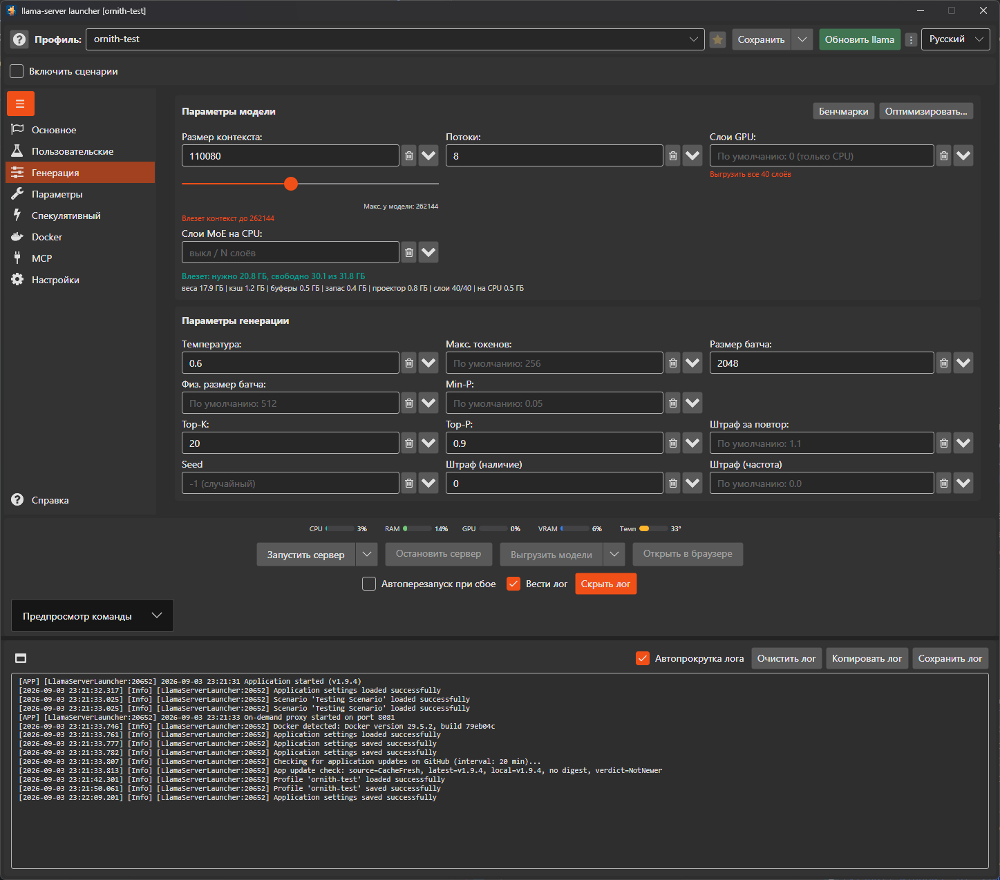
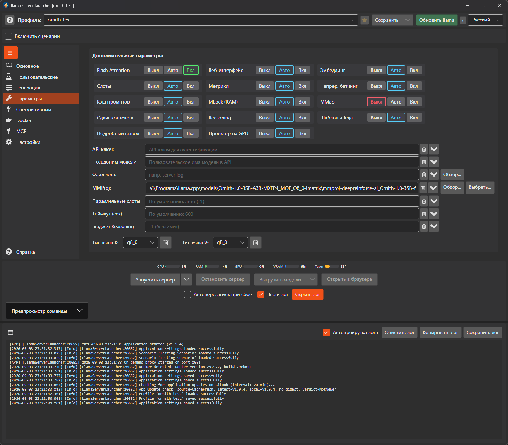
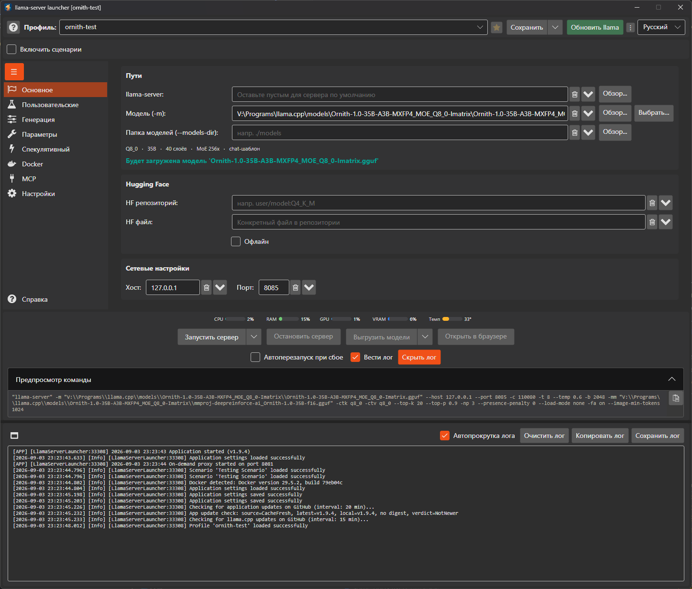
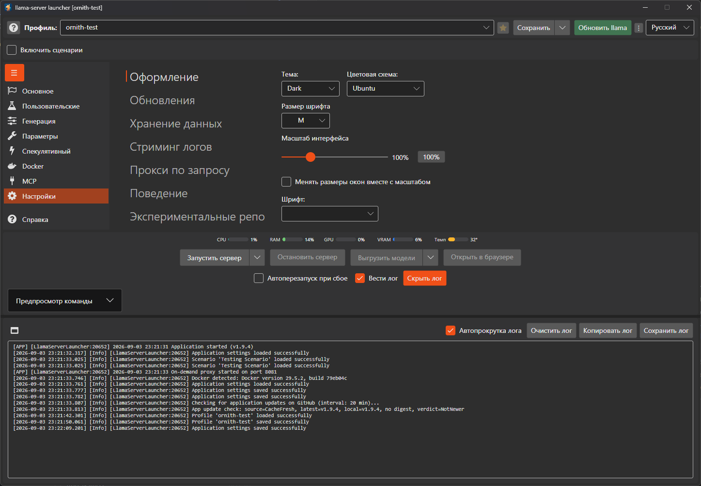
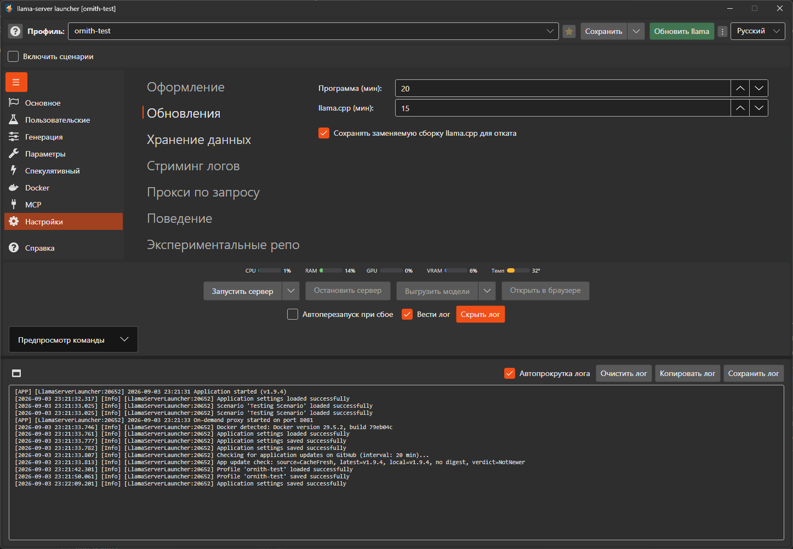

## Интерфейс

  
 <em>Влезет ли модель в VRAM: вердикт, разбивка по частям и подсказки по слоям и контексту</em>
  

  
 <em>Новые переключатели: подробный вывод, проектор на GPU и шаблоны Jinja</em>
  

  
 <em>Кнопка вставки команды из буфера обмена - рядом с панелью просмотра команды</em>
  

  
 <em>Масштаб интерфейса меняет всё окно, а не только размер шрифта</em>
  

  
 <em>Заменяемая сборка llama.cpp сохраняется для отката</em>

