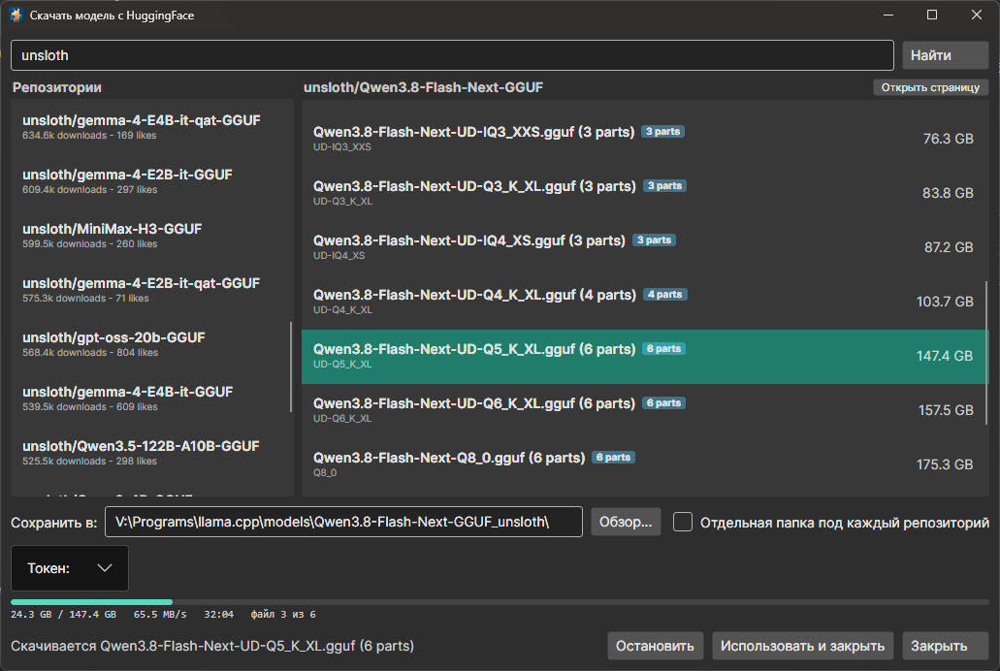
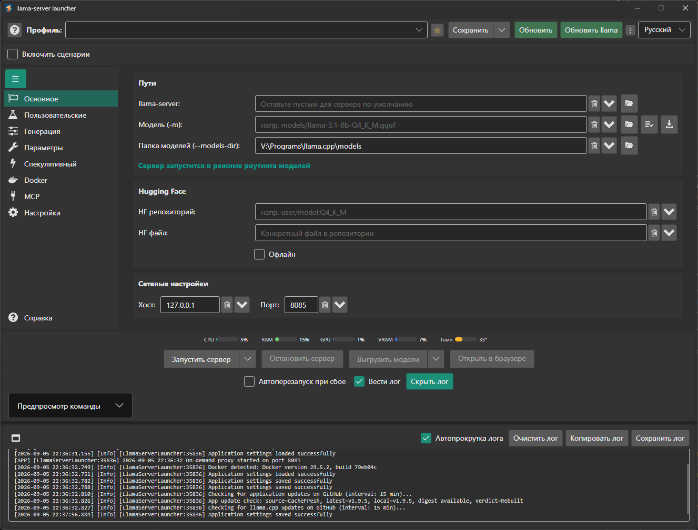
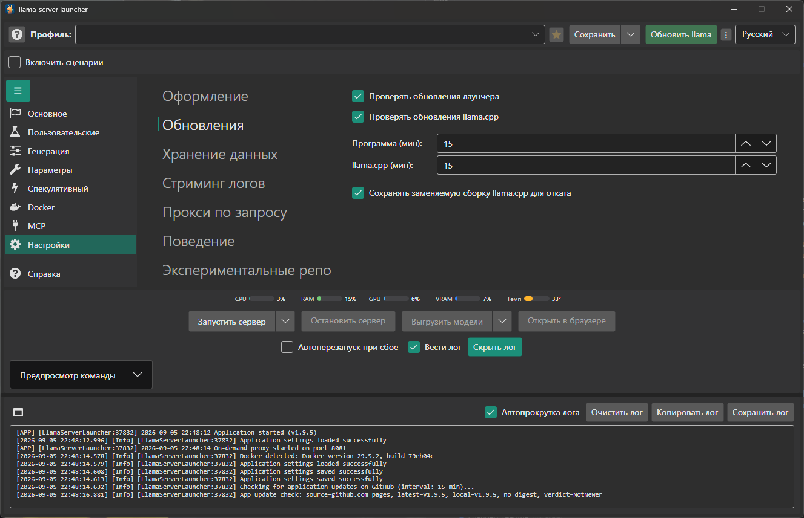

## Интерфейс

  
 <em>Поиск по Хабу, кванты с размерами и скачивание с докачкой - шардированная модель качается всеми частями сразу</em>
  

  
 <em>Кнопка HuggingFace рядом с полем модели, а подписи кнопок у путей уступили место значкам</em>
  

  
 <em>Проверку обновлений можно выключить отдельно для лаунчера и для llama.cpp</em>

