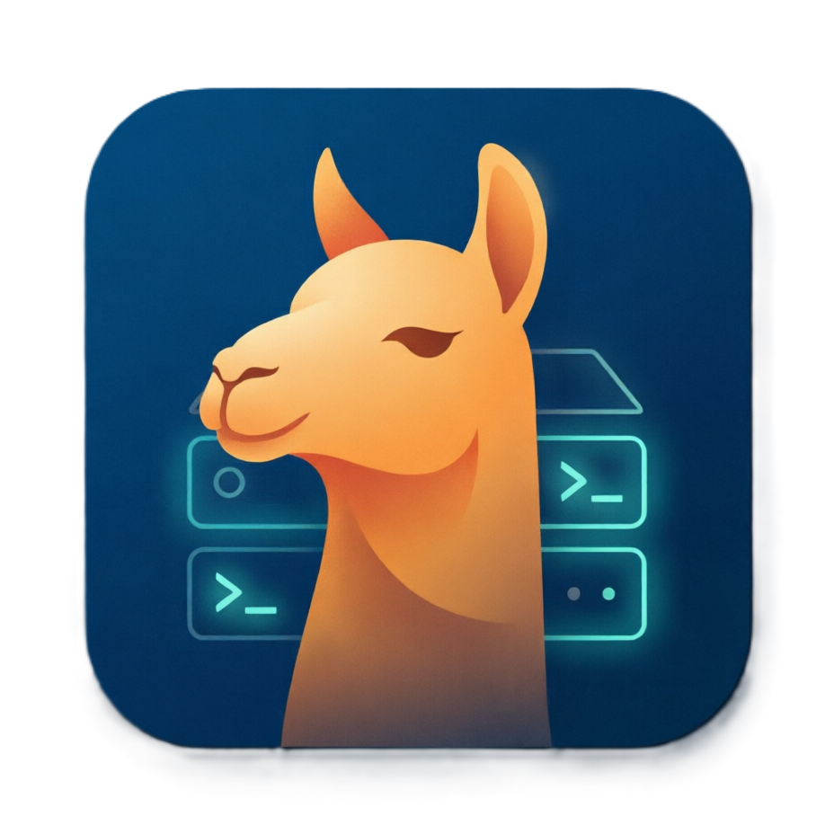

# LlamaCppLauncher



A cross-platform desktop application for launching and managing [llama.cpp](https://github.com/ggerganov/llama.cpp) server instances with an intuitive graphical interface.

## Features

### Server Configuration
- **Executable Path** - Select the `llama-server` binary
- **Model Selection** - Choose a specific model file (.gguf) or set a models directory
- **Network Settings** - Configure host address (default: 127.0.0.1) and port (default: 8080)

### Model Parameters
- Context size (`-c`, `--ctx-size`)
- Number of threads (`-t`, `--threads`)
- GPU layers (`-ngl`, `--gpu-layers`, `--n-gpu-layers`)
- Temperature (`--temp`, `--temperature`)
- Max tokens (`-n`, `--predict`, `--n-predict`)
- Batch size (`-b`, `--batch-size`)
- UBatch size (`-ub`, `--ubatch-size`)
- Min-P sampling (`--min-p`)
- MMProj path (`-mm`, `--mmproj`)
- Cache type K (`-ctk`, `--cache-type-k`)
- Cache type V (`-ctv`, `--cache-type-v`)
- Top-K sampling (`--top-k`)
- Top-P sampling (`--top-p`)
- Repeat penalty (`--repeat-penalty`)

### Advanced Options
- Flash Attention (`-fa`, `--flash-attn`)
- WebUI (`--webui`, `--no-webui`)
- Embedding mode (`--embedding`, `--embeddings`)
- Slots management (`--slots`, `--no-slots`)
- Metrics endpoint (`--metrics`)
- API key authentication (`--api-key`)
- Alias (`-a`, `--alias`)
- Custom command-line arguments

### Logging & Monitoring
- Log file output (`--log-file`)
- Verbose logging (`-v`, `--verbose`)
- Real-time log viewer in the application
- Server status display with process ID

### Profile Management
- Save multiple configuration profiles locally
- Load saved profiles instantly
- Delete unwanted profiles
- Export profiles to JSON format
- Import profiles from JSON files

## Requirements

- .NET 8.0 Runtime or self-contained build
- [llama.cpp](https://github.com/ggerganov/llama.cpp/releases) server binary (`llama-server`)

## Installation

1. Download the latest release from the releases page for your platform
2. Extract the archive to your desired location
3. Run `LlamaServerLauncher`

## Build from Source

### Prerequisites
- [.NET 8 SDK](https://dotnet.microsoft.com/download/dotnet/8.0)

### Build Commands

```bash
# Linux
dotnet publish .\LlamaServerLauncher.csproj -c Release -r linux-x64 -o ./publish/linux-x64

# Windows
dotnet publish .\LlamaServerLauncher.csproj -c Release -r win-x64 -o ./publish/win-x64

# macOS
dotnet publish .\LlamaServerLauncher.csproj -c Release -r osx-x64 -o ./publish/osx-x64
```

## Usage

1. Click "Browse" next to **Executable** and select your `llama-server`
2. Click "Browse" next to **Model** and select your model file (.gguf)
3. Configure additional parameters as needed
4. Click **Start Server** to launch llama-server
5. Monitor logs in the **Log Output** section

### Managing Profiles

To save current settings as a profile:
1. Enter a name in the profile dropdown/input field
2. Click **Save Profile**

To load a saved profile:
1. Select the profile from the dropdown
2. Click **Load Profile**

To export/import configurations:
- Use **Export Profile** to save a single profile as JSON
- Use **Import Profile** to load a single profile from JSON
- Use **Export All** to save all profiles as a ZIP archive
- Use **Import All** to load all profiles from a ZIP archive

## Architecture

- **Framework**: Avalonia 12.0.1 (.NET 8.0)
- **Pattern**: MVVM (Model-View-ViewModel)
- **Build**: Self-contained single-file executable

### Project Structure
```
LlamaServerLauncher/
├── Models/           # Data models and command-line building
├── ViewModels/       # MVVM view models
├── Services/         # Business logic services
└── App.axaml          # Application entry point
```

## License

MIT License - See LICENSE file for details.
