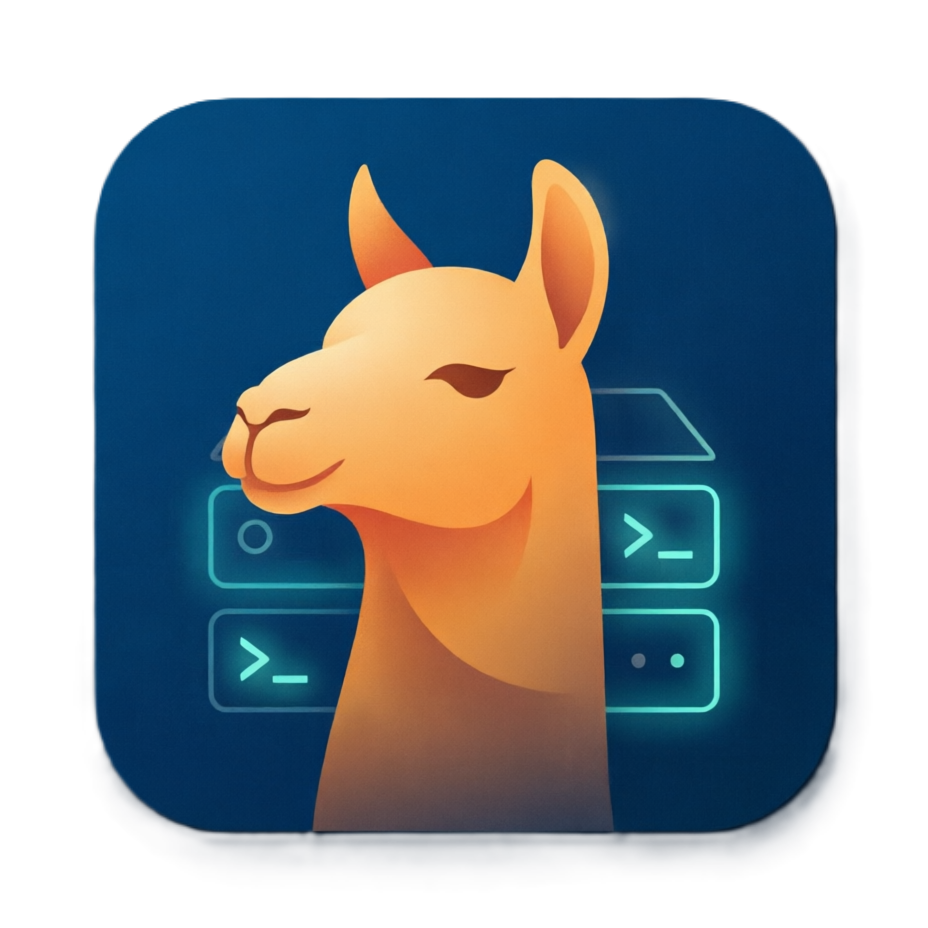

<h1 align="center">LlamaServerLauncher</h1>

<p align="center">
  
</p>

<p align="center">
  <a href="README.md">English</a> &nbsp;·&nbsp; <a href="CHANGELOG.ru.md">История изменений</a>
</p>

<p align="center">
  <a href="https://github.com/pytraveler/LlamaServerLauncherAvalonia/releases/latest"></a>
  <a href="https://github.com/pytraveler/LlamaServerLauncherAvalonia/releases"></a>
  <a href="LICENSE"></a>
  
  
  <a href="https://www.youtube.com/watch?v=vcPGTI_VA4k"></a>
</p>

Кроссплатформенное десктопное приложение для запуска и управления серверными инстансами [llama.cpp](https://github.com/ggerganov/llama.cpp) с интуитивно понятным графическим интерфейсом.

Создано с использованием [Avalonia UI](https://avaloniaui.net/) и .NET 8.

<p align="center">
  
</p>

## Возможности

### Настройка сервера
- **Путь к исполняемому файлу** — Выберите бинарник `llama-server` или загрузите llama.cpp прямо из приложения
- **Выбор модели** — Выберите конкретный файл модели (.gguf), укажите директорию с моделями или репозиторий HuggingFace (`--hf-repo`) и файл (`--hf-file`)
- **Выбор модели из списка** — Сканирование папки (при желании рекурсивное) на файлы `.gguf` с выбором из фильтруемого списка с метаданными, размером файла и меткой mmproj; последняя папка запоминается
- **Сетевые настройки** — Настройте адрес хоста (по умолчанию: 127.0.0.1) и порт (по умолчанию: 8080)
- **API-ключ** — Установите API-ключ аутентификации для сервера
- **Офлайн-режим** — Принудительная работа только из кэша, без обращений к сети (`--offline`)
- **История ввода** — Поля путей и значений запоминают недавно введённые варианты для быстрого повторного использования

### Параметры модели
- Размер контекста (`-c`, `--ctx-size`)
- Количество потоков (`-t`, `--threads`) и потоков батча (`-tb`, `--threads-batch`)
- GPU-слои (`-ngl`, `--gpu-layers`, `--n-gpu-layers`)
- Размер батча (`-b`, `--batch-size`)
- UBatch-размер (`-ub`, `--ubatch-size`)
- Путь к MMProj (`-mm`, `--mmproj`)
- Тип кэша K (`-ctk`, `--cache-type-k`)
- Тип кэша V (`-ctv`, `--cache-type-v`)
- Параллельные слоты (`-np`, `--parallel`)
- Таймаут (`-to`, `--timeout`)
- Seed (`-s`, `--seed`)

### Параметры генерации
- Температура (`--temp`, `--temperature`)
- Максимум токенов (`-n`, `--predict`, `--n-predict`)
- Min-P сэмплирование (`--min-p`)
- Top-K сэмплирование (`--top-k`)
- Top-P сэмплирование (`--top-p`)
- Штраф за повторы (`--repeat-penalty`)
- Штраф за присутствие (`--presence-penalty`)
- Штраф за частоту (`--frequency-penalty`)
- Режим рассуждения (`-rea`, `--reasoning`)
- Бюджет рассуждений (`--reasoning-budget`)

### Спекулятивное декодирование
- Тип спекулятивного декодирования (`--spec-type`)
- Draft-модель (`-md`, `--spec-draft-model`) или draft-репозиторий HuggingFace (`--hf-repo-draft`)
- GPU-слои draft-модели (`-ngld`)
- Draft N-Max / N-Min (`--spec-draft-n-max`, `--spec-draft-n-min`)
- Draft P-Split / P-Min (`--spec-draft-p-split`, `--spec-draft-p-min`)

### Дополнительные опции
- Flash Attention (`-fa`, `--flash-attn`)
- Непрерывное батчирование (`-cb`, `--cont-batching`)
- WebUI (`--webui`, `--no-webui`)
- Режим эмбеддингов (`--embedding`, `--embeddings`)
- Управление слотами (`--slots`, `--no-slots`)
- Метрики (`--metrics`)
- Кэширование промптов (`--cache-prompt`, `--no-cache-prompt`)
- Сдвиг контекста (`--context-shift`, `--no-context-shift`)
- Блокировка памяти (`--mlock`)
- Отображение памяти (`--mmap`, `--no-mmap`) — на сборках, где эти флаги объявлены устаревшими, обе галочки уходят одним `--load-mode`; более старые сборки получают прежнюю запись
- Аутентификация по API-ключу (`--api-key`)
- Псевдоним модели (`-a`, `--alias`)
- Произвольные аргументы командной строки (с возможностью включения/отключения каждого аргумента)

### Определение возможностей
Приложение автоматически парсит вывод `llama-server --help` для определения поддерживаемых флагов. Неподдерживаемые опции визуально помечаются в интерфейсе. Если проба не удалась, лог называет причину — в том числе случай, когда бинарник падает на `--help` и потому упадёт и при запуске, — а фильтрация флагов выключается вместо того, чтобы вырезать из команды всё подряд.

### Встроенная справка
- **Справка по разделу** — кнопка в нижней части панели навигации (или клавиша `F1`) открывает памятку по тому разделу, который сейчас открыт: что делают его поля, чем чревато их изменение и с чего начать
- Собственные кнопки справки есть у окон **Бенчмарки**, **Запуск бенчмарка**, **Сценарии** и **Оптимизация**
- Справка встроена в исполняемый файл и работает офлайн; язык совпадает с языком интерфейса. Внизу каждой памятки — ссылка на полный README на GitHub
- **Понятные пустые состояния** — окно сравнения бенчмарков, когда прогонов ещё нет, объясняет, откуда они берутся, и предлагает запустить первый прямо оттуда
- `Ctrl+F1` — список горячих клавиш

### Информация о GGUF-модели
- **Бейдж модели** — архитектура, квантизация, размер в параметрах, число слоёв/экспертов и информация о vision-проекторе читаются напрямую из GGUF-файла и показываются рядом с путём к модели
- **Определение максимального контекста** — тренировочная длина контекста модели определяется и отображается; слайдер размера контекста ограничивается ею
- **Умные подсказки** — предупреждение, если в качестве модели выбран файл mmproj-проектора, и кликабельная подсказка «выгрузить все N слоёв» для GPU-слоёв

### Управление множественными инстансами сервера
- Запуск нескольких инстансов сервера одновременно, каждый со своим профилем/конфигурацией
- Управление каждым инстансом: старт, стоп, перезапуск, выгрузка модели, открытие в браузере
- **Индикатор загрузки модели** — после старта приложение опрашивает `/health` и показывает «Загрузка модели…», пока сервер действительно не готов отвечать
- **Живые метрики инференса** — токены в секунду для промпта/генерации (парсятся из вывода сервера) и занятые/всего слоты (через `/slots`) отображаются для каждого работающего инстанса
- **Меню «Копировать»** — копирование URL сервера, OpenAI-совместимого базового URL (`…/v1`) или готовой `curl`-команды chat-completion для любого работающего инстанса
- **Советчик по падениям** — распознаёт ошибки pinned-memory / инициализации CUDA, вызванные `--no-mmap`, и предлагает отключить эту опцию в закреплённом уведомлении
- **Без висящих процессов** — сервер и всё, что он порождает (MCP-серверы и запускаемые ими приложения), удерживаются job-объектом Windows: остановка сервера, закрытие лаунчера и даже его падение забирают всех разом; отключается на вкладке **Поведение** (только Windows)
- Индивидуальный автоперезапуск при падении и переключатель логирования для каждого инстанса
- Индикатор ошибки быстрого завершения (показывается, если инстанс завершился в течение 5 секунд после старта)
- Отображение инстансов в меню системного трея с полным набором элементов управления

### Монитор оборудования
- Индикаторы CPU, RAM, загрузки GPU, VRAM и температуры GPU над списком инстансов (с поддержкой нескольких GPU)
- GPU NVIDIA через `nvidia-smi`, AMD через `rocm-smi`; метрики CPU/RAM на Windows, Linux и macOS
- Автоматически приостанавливается на время загрузки модели, чтобы опрос GPU не мешал инициализации CUDA/HIP
- Отключается на вкладке **Поведение**

### Бенчмарки
- **Запуск с сохранением бенчмарка** — запуск профиля в режиме бенчмарка из выпадающего меню кнопки старта сервера, с редактируемой строкой аргументов llama-server (с тогглами по группам аргументов)
- Собирает данные эндпойнта `/metrics` (Prometheus) и токены в секунду из лога; опционально прогоняет встроенную стандартную HTTP-нагрузку по работающему серверу
- **Прогон промта** — задайте модели свои вопросы в рамках прогона: системный промт и список запросов (разделяются строкой `---`), диалогом или независимо; лаунчер поднимает сервер, записывает ответы со скоростями по каждому запросу и гасит его, а полная расшифровка попадает в `prompt-run.md` рядом с отчётом
- Каждый прогон сохраняется по профилю в директории данных (`benchmarks/<профиль>/<runId>/`: конфигурация, командная строка, лог сервера, метрики, отчёт, расшифровка прогона промта)
- **Окно сравнения** — сравнение сохранённых прогонов бок о бок в виде Markdown-таблиц, выбор строк таблицы (метрики, параметры запуска, окружение), именованные наборы сравнения вместе с этим выбором строк, экспорт отчётов в `.md`, прикрепление дополнительных файлов к прогону

### MCP-серверы
Подключение серверов Model Context Protocol к профилю, чтобы запущенная модель могла вызывать внешние инструменты прямо из WebUI llama.cpp (нужна сборка llama.cpp с поддержкой `--mcp-servers-config`).
- **Список серверов по профилям** на вкладке **MCP** — каждый сервер это строка с переключателем; при запуске приложение генерирует Cursor-совместимый `mcp.json` и передаёт его llama-server через `--mcp-servers-config`
- **Редактор сервера** — команда, аргументы, переменные окружения, рабочий каталог и таймаут, с кнопками обзора; кнопка **Проверить** запускает команду так же, как это сделает llama-server, и перечисляет инструменты, которыми она ответила — ещё до загрузки модели
- **Импорт** — чтение серверов из готового `mcp.json` (формат Cursor / Claude Desktop) или копирование из другого профиля через меню кнопки импорта
- **Запрос инструментов** — `GET /tools` у работающего сервера показывает обнаруженные инструменты с группировкой по MCP-серверам
- Неполадки MCP, о которых llama-server сообщает только в лог (не запустившийся или умерший сервер), всплывают уведомлениями
- **Работает с Docker** — каталог сгенерированного конфига монтируется в контейнер, путь переписывается
- Вкладка предупреждает о практических нюансах: серверы работают дочерними процессами с правами лаунчера, включение MCP ограничивает CORS до localhost, если не задать явно, а вызовы инструментов требуют jinja-шаблонов

### Прокси загрузки моделей по запросу (OpenAI-совместимый)
Встроенный обратный прокси, который по входящему API-запросу сам поднимает нужный профиль — направьте на него клиент вроде Cherry Studio, и подходящая модель загрузится автоматически, обработает запрос и выгрузится при простое.
- **OpenAI-эндпойнты** — `/v1/chat/completions`, `/v1/completions`, `/v1/embeddings`, `/v1/rerank`, `/infill`, а также `/v1/models` (отдаёт профили как модели) и `/health`
- **Профиль = модель** — передайте имя профиля в поле `model` запроса; прокси запускает этот профиль, ждёт его готовности, проксирует запрос и стримит ответ обратно (SSE поддерживается)
- **Одна модель в VRAM** — запуск профиля останавливает любой другой работающий, так что загруженной остаётся только одна модель
- **Авто-выгрузка по простою** — останавливает сервер после настраиваемого таймаута простоя (`0` отключает)
- **Доступ по сети** — слушает на всех интерфейсах; опциональный Bearer-ключ для контроля доступа
- Профили в режиме роутинга (`--models-dir`) исключаются из списка отдаваемых моделей

### Интеграция с ComfyUI
- **Освобождение VRAM ComfyUI перед загрузкой профиля** — при желании вызывает эндпойнт ComfyUI `/free`, чтобы выгрузить его модели и освободить память GPU перед запуском любого профиля (ручной старт или через прокси по запросу), позволяя передавать GPU между ComfyUI и llama.cpp без ручного жонглирования. Настраивается на вкладке **Поведение** (тоггл + URL ComfyUI)

### Сценарии
- Определение последовательностей профилей, запускаемых по порядку с настраиваемыми интервалами
- Автозапуск сценариев при старте приложения
- Создание, редактирование, переименование и удаление сценариев
- Drag-and-drop упорядочивание профилей внутри сценария
- Клонирование профиля напрямую в сценарий

### Логирование и мониторинг
- Вывод логов в файл (`--log-file`)
- Подробное логирование (`-v`, `--verbose`)
- Просмотрщик логов в реальном времени с автоскроллом
- Отображение статуса сервера с PID процесса
- Автоперезапуск при падении
- Автоматическая ротация лог-файлов (настраиваемые лимиты количества и размера)
- Служебные строки от опроса health/slots отфильтровываются из просмотрщика логов
- **Падение объясняется, а не просто нумеруется** — код выхода от системы расшифровывается в логе (`-1073741819 (0xC0000005, STATUS_ACCESS_VIOLATION)`) вместе с тем, что его обычно порождает; сервер, умерший без единой строки вывода, отмечается отдельно, а в лог добавляются версии MSVC-библиотек из System32 и рядом с бинарником: отсутствующий или устаревший Visual C++ Redistributable — частая причина
- **Указанные пути проверяются при каждом запуске** — каким бы способом ни стартовал сервер, модель, проектор, черновая модель или файл за пользовательским аргументом, которых больше нет на диске, называются в логе и в уведомлении
- **Встроенный сервер потоковой передачи логов** — WebSocket-поток логов с HTTP API:
  - `/ws` — Потоковая передача логов через WebSocket с опциональной токен-аутентификацией
  - `/api/logs/history` — JSON-эндпоинт истории логов
  - `/api/status` — Статус сервера потоков
  - Встроенная HTML-страница просмотра логов с автоскроллом, очисткой и переподключением

### Интеграция с llama.cpp
- **Загрузка в один клик** — Скачивание официальных релизов llama.cpp напрямую с GitHub
- **Автоопределение бэкенда** — диалог загрузки определяет производителя GPU (NVIDIA / AMD / Intel / Apple) и предварительно выбирает наиболее подходящую сборку (CUDA / Vulkan / HIP / SYCL / CPU) с подсказкой «Автоопределено»; выбор можно изменить вручную
- **Уведомления об обновлениях** — Автоматическая проверка новых релизов llama.cpp
- **Управление версиями** — Установка и переключение между различными версиями
- **Интеграция с PATH** — Возможность добавить директорию llama.cpp в переменную окружения PATH
- **Экспериментальные репозитории сборок** — Добавление собственных GitHub-источников релизов (например, [llama-cpp-turboquant](https://github.com/pytraveler/llama-cpp-turboquant)) с фильтрами по тегам и периодической проверкой обновлений для загрузки экспериментальных сборок
- **Пустой список сборок объясняет сам себя** — пока релиз перечитывается по тегу, так и написано, а дальше диалог различает релиз без файлов вовсе, релиз без сборок llama.cpp под какую-либо платформу (экспериментальные теги `v0.*`) и релиз, сборки которого не подходят вашей ОС

### Обновление приложения
- **Автообновление** — Автоматическая проверка новых релизов приложения и поддержка обновления в один клик с перезапуском
- **Заметки к релизу** — диалог обновления показывает release notes с GitHub в виде отрендеренного Markdown
- **Отображение версии** — Диалог «О программе» показывает установленную версию (проставляется при сборке) и, если периодическая проверка уже что-то нашла, последний доступный релиз — без дополнительных обращений к GitHub API

### Системная интеграция
- **Автозапуск** — Регистрация приложения для запуска вместе с ОС (реестр Windows, .desktop в Linux, LaunchAgent в macOS)
- **Единственный экземпляр** — Обеспечивает запуск только одного экземпляра; повторный запуск активирует существующее окно
- **Всплывающие уведомления** — Внутриприложенческие toast-уведомления о важных событиях и ошибках
- **Выбор браузера** — Открытие WebUI сервера в выбранном браузере; установленные браузеры определяются автоматически, либо можно указать произвольный путь к браузеру

### Поддержка Docker
- Интеграция с Docker CLI для контейнерных сценариев использования
- Запуск отдельных инстансов в Docker-контейнерах

### Управление профилями
- Сохранение, загрузка, переименование и удаление профилей конфигурации
- Экспорт профилей в JSON, Windows batch (.bat), Linux shell (.sh) или macOS script (.command)
- Импорт профилей из JSON
- Экспорт/импорт всех профилей в ZIP-архив
- Отслеживание несохранённых изменений
- Клонирование профилей для быстрого создания вариантов
- **Избранное** - звёздочка рядом с выпадающим списком закрепляет профиль в начале списка, над разделительной чертой, чтобы рабочие профили не приходилось искать прокруткой
- **Выбор при импорте** - импортируемый файл (брошенный на окно или выбранный в меню) сначала показывает, что он изменит, по полям, и вы отмечаете, что взять; `.bat` и `.sh` не трогают поля, о которых в них ничего не сказано. Отключается на вкладке **Поведение**
- **Профили с пропавшими файлами** помечаются в списке профилей предупреждающим цветом, а подсказка называет, каких именно путей не хватает — перенесённые на другой диск модели перестают быть загадкой

### Drag & Drop
Перетаскивайте файлы на окно для импорта конфигураций или установки путей:
- `.json` — Импорт профиля
- `.bat` / `.cmd` — Парсинг Windows batch-файлов
- `.sh` — Парсинг Linux shell-скриптов
- `.command` — Парсинг macOS-скриптов
- `.exe` — Установка пути к исполняемому файлу llama-server
- `.gguf` — Установка пути к модели

### Системный трей
- Сворачивание в системный трей при минимизации окна — отключается на вкладке **Поведение**, и тогда свёрнутое окно остаётся на панели задач, как любое другое; значок в трее остаётся в обоих случаях
- Меню иконки трея с индивидуальным управлением каждым инстансом (старт, стоп, перезапуск, переключатель автоперезапуска, переключатель логирования, выгрузка модели, открытие в браузере)
- Двойной клик по иконке трея для восстановления окна

### Локализация
- Английский
- Русский

### Внешний вид и темы
- Варианты тем: Тёмная и Светлая
- Цветовые схемы: Стандартная, Океан, Лес, Закат, Ubuntu, плюс схема **Пользовательская**, где настраиваются фон окна и панелей, акцент, разделители, блок команды, позиции переключателей и полоса загрузки
- Цвета принадлежат теме приложения, а не системному акценту, поэтому интерфейс читается одинаково на любой машине
- Регулируемый размер шрифта (S, M, L, XL)
- Выбор шрифта интерфейса
- Режим авторазмера высоты окна (по содержимому, с ограничением рабочей областью экрана)
- Сворачиваемая панель логов и панель настроек
- Сохранение позиции и размера окна
- Сохранение позиции и размера диалоговых окон

### Управление данными
- Настраиваемая директория данных (стандартная или произвольная)
- Простая миграция всех данных (настроек, логов, llama.cpp) между директориями

## Требования

- .NET 8.0 Runtime или self-contained сборка
- Бинарник сервера [llama.cpp](https://github.com/ggerganov/llama.cpp/releases) (`llama-server`), или загрузите его из приложения

## Установка

1. Скачайте последний релиз со [страницы релизов](https://github.com/pytraveler/LlamaServerLauncherAvalonia/releases) для вашей платформы
2. Поместите исполняемый файл в удобное место
3. Запустите `LlamaServerLauncher`

## Проверка релизов

Все бинарники релизов собираются в GitHub Actions и сопровождаются
[аттестацией происхождения сборки (provenance)](https://docs.github.com/actions/security-guides/using-artifact-attestations)
и контрольными суммами SHA-256 (файл с суммами подписан GPG). Сами бинарники
code-signing-подписи **не** имеют, поэтому проверка provenance/контрольных сумм —
рекомендуемый способ доверять загрузке.

### 1. Проверка происхождения (доказывает, что бинарник собран из этого репозитория)

Требуется [GitHub CLI](https://cli.github.com/):

```bash
gh attestation verify LlamaServerLauncher_win_x64.exe \
  --repo pytraveler/LlamaServerLauncherAvalonia
```

### 2. Проверка целостности (контрольные суммы)

```bash
# Linux / macOS
sha256sum -c SHA256SUMS

# Windows PowerShell — сравните со значением в SHA256SUMS
(Get-FileHash LlamaServerLauncher_win_x64.exe -Algorithm SHA256).Hash
```

### 3. Проверка подписи контрольных сумм (опционально, GPG)

Публичный ключ лежит в этом репозитории —
[`LlamaServerLauncherAvalonia-public.asc`](LlamaServerLauncherAvalonia-public.asc)
(а также приложен к каждому релизу). Брать ключ из репозитория по HTTPS —
более надёжный якорь доверия.

```bash
gpg --import LlamaServerLauncherAvalonia-public.asc
gpg --verify SHA256SUMS.asc SHA256SUMS
```

Отпечаток ключа подписи (сверьте после импорта):

```
7CE2 D333 77DD 11F2 2748  DC40 2B4E E046 8C62 EBA1
```

## Сборка из исходников

### Необходимые компоненты
- [.NET 8 SDK](https://dotnet.microsoft.com/download/dotnet/8.0)

### Команды сборки

```bash
# Отладочная сборка
dotnet build LlamaServerLauncher.csproj

# Linux
dotnet publish LlamaServerLauncher.csproj -c Release -r linux-x64 -o ./publish/linux-x64

# Windows
dotnet publish LlamaServerLauncher.csproj -c Release -r win-x64 -o ./publish/win-x64

# macOS (Intel)
dotnet publish LlamaServerLauncher.csproj -c Release -r osx-x64 -o ./publish/osx-x64

# macOS (Apple Silicon)
dotnet publish LlamaServerLauncher.csproj -c Release -r osx-arm64 -o ./publish/osx-arm64
```

## Тесты

В проекте используются лёгкие самостоятельные консольные наборы тестов вместо тестового фреймворка — без xUnit/NUnit, в соответствии с политикой проекта «без сторонних зависимостей». Каждый набор напрямую подключает нужные исходники приложения, исключён из основной сборки и возвращает код выхода `0`, если все проверки прошли.

```bash
cd tests
dotnet run -c Release   # код выхода 0 = все проверки пройдены
```

Текущее покрытие включает слой командной строки (`CommandLineParser`, `CommandLineBuilder`, `ServerConfiguration`), движок оптимизации (HPO), хелперы протокола прокси по запросу (`ProxyProtocol`), чтение GGUF-метаданных, сканирование папки моделей, парсеры метрик инференса/GPU/CPU (NVIDIA + AMD), построение endpoint/curl-сниппетов, выбор сборки llama.cpp под бэкенд, фильтрацию логов сервера, советчик по падениям, конвейер метрик/отчётов бенчмарков, MCP-конфигурацию (генерация, парсинг, валидация, встраивание в командную строку) и прогон промта в бенчмарках (разбиение запросов, разбор ответов, построение расшифровки). Каждая область — отдельный файл `*Tests.cs`, подключаемый в `Program.cs`, поэтому покрытие растёт постепенно.

## Использование

1. Нажмите **Download llama.cpp**, чтобы скачать бинарник, или нажмите **Browse** рядом с **Executable** и выберите ваш `llama-server`
2. Нажмите **Browse** рядом с **Model** и выберите файл модели (.gguf), или укажите директорию с моделями, или введите репозиторий HuggingFace
3. При необходимости настройте дополнительные параметры
4. Нажмите **Start Server** для запуска llama-server
5. Следите за логами в разделе **Log Output**
6. Используйте **Open in Browser** для открытия WebUI llama-server

### Управление профилями

Для сохранения текущих настроек в профиль:
1. Введите имя в поле профиля или выберите существующий профиль из выпадающего списка
2. Нажмите **Save**

Для загрузки сохранённого профиля:
1. Выберите профиль из выпадающего списка
2. Нажмите **Load**

Для экспорта конфигураций:
- Используйте **Export** для сохранения в JSON, batch-файл (.bat), shell-скрипт (.sh) или macOS-скрипт (.command)
- Используйте **Export All** для сохранения всех профилей в ZIP-архив
- Используйте **Import** для загрузки одного профиля из JSON
- Используйте **Import All** для загрузки всех профилей из ZIP-архива
- Перетащите файлы `.json`, `.bat`, `.cmd`, `.sh` или `.command` на окно приложения

### Работа со сценариями

Сценарии позволяют запускать несколько профилей последовательно с переходами по времени:

1. Нажмите **Scenarios** для открытия интерфейса управления сценариями
2. Нажмите **New Scenario** для создания сценария
3. Добавьте профили в сценарий в нужном порядке
4. Установите интервал (в секундах) между переключениями профилей
5. При желании включите **Auto-start** для запуска сценария при старте приложения
6. Сохраните сценарий

### Запуск бенчмарков

Режим бенчмарка фиксирует метрики производительности профиля, чтобы потом сравнивать разные настройки:

1. Откройте выпадающее меню кнопки **Start Server** и выберите **Запустить и сохранить бенчмарк**
2. При желании отредактируйте строку аргументов llama-server и выберите, что собирать (данные `/metrics`, встроенную стандартную нагрузку, число повторов)
3. При желании включите **Прогон промта** — задайте системный промт и список запросов (строка из трёх и более дефисов начинает следующий); лаунчер отправит их модели, сохранит ответы в `prompt-run.md` и погасит сервер по окончании
4. Запустите бенчмарк; после остановки сервера прогон автоматически сохраняется в профиле
5. Нажмите **Бенчмарки**, чтобы открыть окно сравнения: выберите прогоны, сравните их бок о бок в Markdown-таблицах, сузьте таблицу фильтром **Строки**, сохраняйте именованные наборы сравнения (прогоны + выбор строк) и экспортируйте отчёты в `.md`

### Подключение MCP-серверов

MCP-серверы дают запущенной модели внешние инструменты, вызываемые прямо из WebUI llama.cpp:

1. На вкладке **MCP** нажмите **Добавить сервер** и заполните команду (на Windows указывайте расширение скрипта: `npx.cmd`, а не `npx`), аргументы и при необходимости переменные окружения, рабочий каталог и таймаут
2. Нажмите **Проверить** — команда запустится так же, как её запустит llama-server, и покажет свои инструменты, без загрузки модели
3. Либо используйте **Импорт mcp.json** для чтения готовой конфигурации Cursor / Claude Desktop, или его меню — для копирования серверов из другого профиля
4. Включите **Запускать сервер с этими MCP-серверами** и запустите профиль; кнопка **Запросить** покажет, какие инструменты работающий сервер реально обнаружил

### Сервер потоковой передачи логов

Встроенный сервер логов позволяет удалённо отслеживать логи:

1. Включите и настройте сервер логов в настройках (порт и опциональный токен)
2. Откройте `http://localhost:<port>/` в браузере для встроенного веб-просмотрщика
3. Подключитесь через WebSocket по адресу `ws://localhost:<port>/ws?token=<token>` для логов в реальном времени

### Прокси загрузки моделей по запросу

Позвольте OpenAI-совместимому клиенту загружать модели по запросу вместо ручного переключения профилей:

1. Включите и настройте прокси в настройках (вкладка **Прокси по запросу**): порт, таймаут авто-выгрузки по простою, опциональный API-ключ
2. Направьте клиент (например, Cherry Studio) на `http://<host>:<port>/v1` и используйте **имя профиля** в качестве имени модели
3. На каждый запрос прокси запускает подходящий профиль (останавливая любой другой работающий), ждёт его готовности и проксирует ответ — со стримингом
4. После таймаута простоя без запросов сервер останавливается автоматически

При желании на вкладке **Поведение** включите **Освобождать VRAM ComfyUI перед загрузкой профиля** и укажите URL ComfyUI, чтобы память GPU освобождалась перед загрузкой каждой модели.

## Архитектура

- **Фреймворк**: Avalonia 12.0.1 (.NET 8.0)
- **Паттерн**: MVVM (Model-View-ViewModel)
- **Сборка**: Self-contained однофайловый исполняемый файл

### Структура проекта
```
LlamaServerLauncher/
├── Models/                            # Модели данных и сборка командной строки
│   ├── ServerConfiguration            # Все параметры llama-server + маппинг KnownArguments
│   ├── CommandLineBuilder             # Формирование полной командной строки llama-server
│   ├── CommandLineParser              # Токенизация и парсинг аргументов (кавычки, JSON, массивы)
│   ├── LlamaArgumentDefinition        # Структурированные метаданные аргументов (флаг, псевдонимы, описания, значения)
│   ├── LlamaArgumentRegistry          # Полный реестр известных аргументов llama-server с EN/RU документацией
│   ├── ServerInstance                 # Управление жизненным циклом каждого инстанса сервера
│   ├── ScenarioInfo                   # Определение сценария (последовательность профилей, интервал, автозапуск)
│   ├── AppSettings                    # Постоянные настройки приложения (включая геометрию диалогов)
│   ├── ProfileInfo                    # Метаданные профиля
│   ├── ExperimentalRepoInfo           # Описание экспериментального репозитория + кэш релизов
│   ├── BrowserInfo                    # Обнаруженный браузер (имя + путь к исполняемому файлу)
│   ├── HelpArgumentInfo               # Метаданные аргументов справки для определения возможностей
│   ├── ProxyProtocol                  # HTTP/JSON-хелперы для прокси по запросу (разбор запроса, подбор модели)
│   ├── InferenceStatsParser           # Парсинг токенов в секунду из вывода сервера
│   ├── GpuStatsParser / AmdGpuParser  # Парсинг вывода nvidia-smi / rocm-smi
│   ├── CpuUsage / HardwareSnapshot    # Расчёт загрузки CPU + сводный снимок метрик оборудования
│   ├── ServerLogFilter                # Отфильтровывает шум опроса health/slots из логов
│   ├── ServerCrashAdvisor             # Распознаёт сигнатуры падений pinned-memory при --no-mmap
│   ├── ModelScanEntry                 # Элемент списка выбора модели + форматирование GGUF-метаданных
│   ├── EndpointSnippets               # Построители URL эндпойнтов / curl-сниппетов
│   ├── BackendAssetSelector           # Выбор лучшей сборки llama.cpp под определённый GPU
│   ├── Benchmarking/                  # BenchmarkRun, BenchmarkMetrics, BenchmarkComparisonSet,
│   │                                  #   PromptRunReport/Document, ChatCompletionResponse, ModelListResponse
│   ├── McpServerEntry                 # Один MCP-сервер профиля (команда, аргументы, окружение, каталог, таймаут)
│   ├── McpConfigDocument              # Сборка/парсинг/валидация Cursor-совместимого mcp.json
│   ├── ServerToolsResponse            # Разбор GET /tools работающего сервера
│   └── AppInfo                        # Доступ к версии приложения (рефлексия)
├── ViewModels/                        # MVVM ViewModel'и
│   ├── MainViewModel                  # Основная логика и состояние (множественные инстансы, сценарии)
│   ├── ScenarioDialogViewModel        # Логика создания и редактирования сценариев
│   ├── ExperimentalRepoDialogViewModel # Логика диалога добавления/редактирования экспериментального репозитория
│   ├── ModelPickerViewModel           # Логика диалога сканирования/выбора модели
│   ├── BenchmarkLaunchViewModel       # Логика диалога настройки запуска бенчмарка
│   ├── BenchmarkComparisonViewModel   # Логика окна сравнения бенчмарков
│   ├── McpServerDialogViewModel       # Логика окна редактирования MCP-сервера (валидация, проверка)
│   ├── McpValidationFormatter / McpImportSource # Форматирование замечаний MCP и пункты меню импорта
│   ├── DownloadDialogViewModel
│   ├── ArgumentPickerViewModel
│   ├── IOnDemandProxyHost             # Мост для прокси: запуск/остановка профилей
│   └── RelayCommand / AsyncRelayCommand
├── Services/                          # Сервисы бизнес-логики
│   ├── LlamaServerService             # Управление процессами, HTTP-запросы слотов/моделей
│   ├── ILlamaServerService            # Интерфейс сервиса
│   ├── ConfigurationService           # Персистентность профилей и настроек (JSON)
│   ├── LlamaCppDownloadService        # Загрузка релизов llama.cpp с GitHub
│   ├── LlamaHelpParserService         # Парсинг вывода --help для определения возможностей
│   ├── LogService                     # Управление логами приложения и сервера
│   ├── LogStreamService               # WebSocket-сервер потоковой передачи логов с HTTP API
│   ├── OnDemandProxyService           # OpenAI-совместимый прокси по запросу (авто-загрузка профилей, выгрузка по простою, ComfyUI free)
│   ├── ToastService                   # Система всплывающих уведомлений внутри приложения
│   ├── AutoStartService               # Автозапуск системы (Windows/Linux/macOS)
│   ├── SingleInstanceService          # Обеспечение единственного экземпляра с IPC-активацией
│   ├── DockerCliService               # Интеграция с Docker CLI
│   ├── AppUpdateService               # Автообновление приложения через GitHub-релизы
│   ├── ExperimentalRepoService        # Экспериментальные репозитории сборок (свои GitHub-источники релизов)
│   ├── BrowserDetectionService        # Определение установленных браузеров для запуска WebUI
│   ├── GgufMetadataService            # Чтение GGUF-метаданных (контекст, слои, квантизация, vision-проектор)
│   ├── ModelScanService               # Рекурсивное сканирование папки на .gguf для выбора модели
│   ├── HardwareMonitorService         # Опрос CPU/RAM/GPU/VRAM (провайдеры nvidia-smi + rocm-smi)
│   ├── SystemMetrics                  # Системные метрики CPU/RAM (Windows/Linux/macOS)
│   ├── GpuVendorDetector              # Одноразовое определение производителя GPU для автоопределения бэкенда
│   ├── Benchmarking/                  # PrometheusMetricsParser, BenchmarkReportBuilder/Localizer,
│   │                                  #   BenchmarkStorageService, BenchmarkRunController, ShellHelper,
│   │                                  #   PromptRunService (чат-запросы прогона промта)
│   ├── McpConfigService               # Пишет mcp.json профиля, с которым стартует сервер
│   ├── McpProbeService                # Запускает команду MCP-сервера и спрашивает её инструменты
│   ├── WindowsProcessJob              # Job-объект, удерживающий сервер и всё им порождённое
│   ├── WindowsFileDialogs             # Абстракции выбора файлов/папок
│   ├── HelpService                    # Загрузка и показ встроенной справки по разделам
│   ├── DialogPositionHelper           # Сохранение позиции и размера диалоговых окон
│   └── DataPathResolver               # Разрешение путей и миграция директории данных
├── Converters/                        # UI-конвертеры значений
├── Controls/                          # Пользовательские UI-элементы
│   ├── HistoryTextBox                 # TextBox с навигацией по истории
│   ├── TriStateSelector               # Трёхпозиционный переключатель (вкл/выкл/по умолчанию)
│   ├── BoolSelector                   # Двухпозиционный переключатель в том же визуальном языке
│   └── MarkdownRenderer               # Лёгкий рендерер Markdown (включая GFM-таблицы)
├── Resources/                         # Локализация, темы и ресурсы
│   ├── Strings.resx                   # Английская локализация
│   ├── Strings.ru.resx                # Русская локализация
│   ├── LocalizedStrings.cs            # Строго типизированный доступ к локализации
│   ├── Docs/                          # Встроенная справка (Markdown, en + ru)
│   ├── Themes/
│   │   ├── Dark.xaml                  # Тёмная тема
│   │   ├── Light.xaml                 # Светлая тема
│   │   └── Schemes/                   # Цветовые акценты
│   │       ├── Default.xaml
│   │       ├── Ocean.xaml
│   │       ├── Forest.xaml
│   │       ├── Sunset.xaml
│   │       └── Ubuntu.xaml
│   └── *.svg                          # Иконки
├── MainWindow.axaml                   # Главное окно с поддержкой drag-and-drop
├── ScenarioDialogWindow.axaml         # Диалог создания и редактирования сценариев
├── ExperimentalRepoDialogWindow.axaml # Диалог добавления/редактирования экспериментального репозитория
├── ModelPickerWindow.axaml            # Выбор GGUF-модели (сканирование папки + список с метаданными)
├── BenchmarkLaunchWindow.axaml        # Диалог настройки запуска бенчмарка
├── BenchmarkComparisonWindow.axaml    # Окно сравнения бенчмарков (Markdown-таблицы)
├── McpServerDialogWindow.axaml        # Окно редактирования MCP-сервера
├── MarkdownViewerWindow.axaml         # Просмотрщик Markdown (release notes, отчёты)
├── DownloadDialogWindow.axaml
├── ArgumentPickerWindow.axaml
├── AboutDialogWindow.axaml
└── App.axaml                          # Точка входа, иконка трея, управление культурой, single-instance
```

## Благодарности

Спасибо за вклад в проект и моральную поддержку — [Methelina](https://github.com/Methelina). Спасибо за предоставленные [экспериментальные сборки llama.cpp-turboquant](https://github.com/pytraveler/llama-cpp-turboquant).

Спасибо [MrGips](https://www.youtube.com/@ProComfy) за видеообзор лаунчера — [«Удобный запуск локальных LLM в llama.cpp (Llama Launcher)»](https://www.youtube.com/watch?v=vcPGTI_VA4k).

## Лицензия

MIT License — подробности см. в файле LICENSE.
